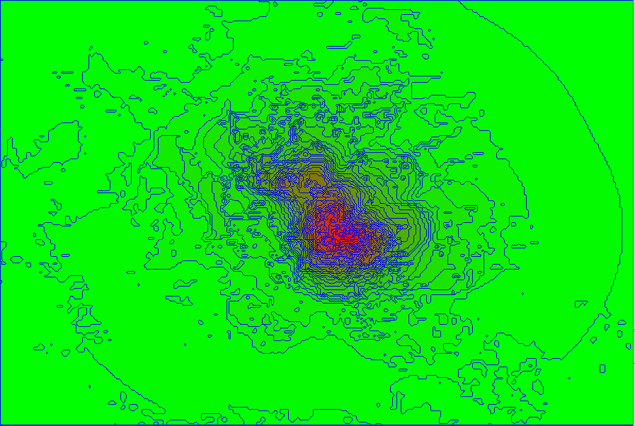

# isobands

Java project for the creation of an isoband vectorial map starting from a grid of values. Implements the marching squares algorithm
https://en.wikipedia.org/wiki/Marching_squares

Supports reading from .CSV file in the format:

x1;y1;value

x2;y1;value

x3;y1;value

x1;y2;value

x2;y2;value

x3;y2;value

Draws the map in a preview window, with mouse selection, panning, zoom.

Exports in .CSV format with WKT geometry (ready for QGIS import) or in ESRI shapefile format.

Example usage:

/* setup: */

Isobands i = new Isobands();

i.setMinLevel(0.0);

i.setMaxLevel(70.0); // optional: if not present the maximum level is computed from data

i.setStep(1.0);

/* input file reading: */

i.readCsv("c:/testdir/curve_levels.csv");
	
/* calculation */

i.calculateCurves();

/* preview window */

i.mirrorY(true);    // mirrors the Y in the preview plot

i.draw();
		
/* export */

i.exportCsv("c:/testdir/curve_output_isobands.csv");

i.exportShp("c:/testdir/curve_output_isobands");  // avoid file extension; 3 files (.shp, .shx, .dbf) files will be created
